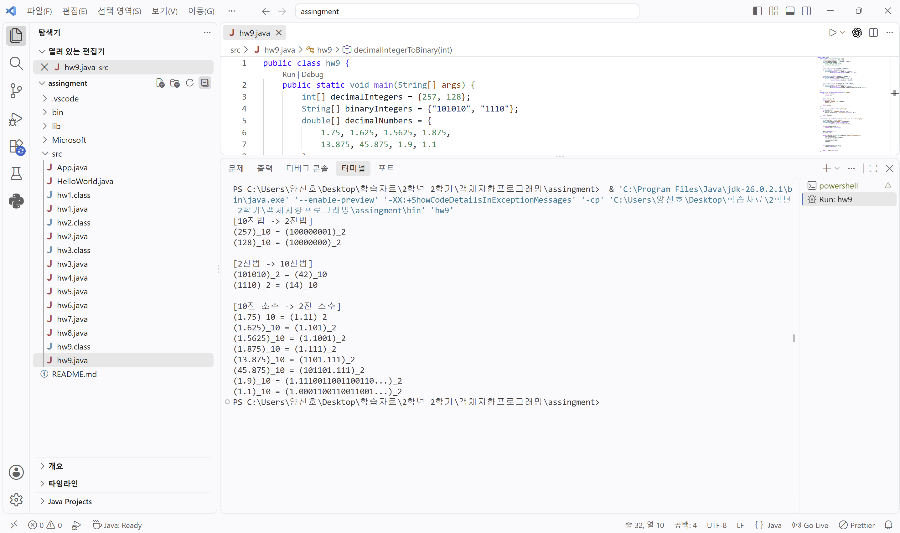
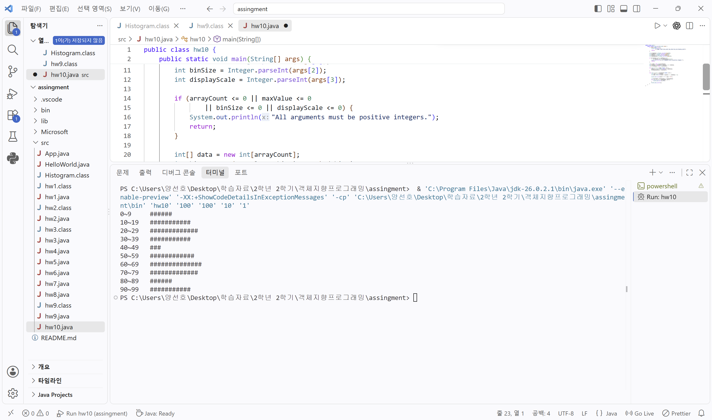
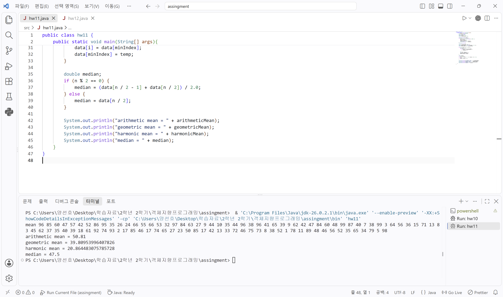
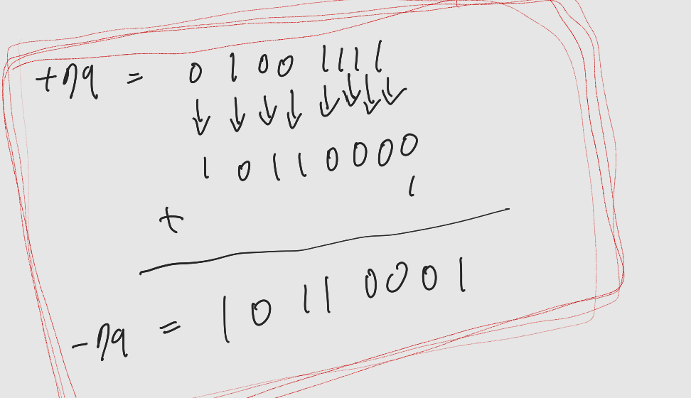

# OOP2026
## HomeWork1
-------------
```java
public class hw1 {
    public static void main(String[] args) {
        for (int i = 1; i <= 4; i++) {
            for (int j = 1; j <= i; j++) {
                System.out.print("#");
            }
            for (int j = 1; j <= 7 - i; j++) {
                System.out.print(" ");
            }

            for (int j = 1; j < i; j++) {
                System.out.print(" ");
            }
            for (int j = 1; j <= 5 - i; j++) {
                System.out.print("#");
            }
            for (int j = 1; j <= 3; j++) {
                System.out.print(" ");
            }

            for (int j = 1; j <= i; j++) {
                System.out.print("#");
            }
            for (int j = 1; j <= 7 - i; j++) {
                System.out.print(" ");
            }

            for (int j = 1; j < i; j++) {
                System.out.print(" ");
            }
            for (int j = 1; j <= 5 - i; j++) {
                System.out.print("#");
            }
            System.out.println();
        }
    }
}
```


## HomeWork2
-------------
```java
public class hw2 {
    public static void main(String[] args) {
        int first = 1;
        int second = 1;

        for (int i = 1; i <= 20; i++) {
            System.out.print(first);

            if (i < 20) {
                System.out.print(" ");
            }

            int next = first + second;
            first = second;
            second = next;
        }

        System.out.println();
    }
}
```


## HomeWork3
-------------
```java
public class hw3 {
    public static void main(String[] args) {
        int first = 1;
        int second = 1;

        for (int i = 1; i < 20; i++) {
            if (i >= 2) {
                double ratio = (double) second / first;
                System.out.println(second + "/" + first + "=" + ratio);
            }

            int next = first + second;
            first = second;
            second = next;
        }
    }
}
```


## HomeWork4
-------------
```java
public class hw4 {
    public static void main(String[] args) {
        for (int i = 1; i <= 9; i++) {
            for (int j = 1; j <= 9; j++) {
                System.out.print(j + "*" + i + "=" + (j * i));
                if (j < 9) {
                    System.out.print("\t");
                }
            }   
            System.out.println();
        }
    }
}
```


## HomeWork5
-------------
```java
public class hw5 {
    public static void main(String[] args) {
        double gregoryPi = 0.0;
        int sign = 1;

        for (int k = 0; k < 1000000; k++) {
            gregoryPi += sign * 4.0 / (2 * k + 1);
            sign = -sign;
        }

        double madhavaSum = 0.0;

        for (int k = 0; k < 40; k++) {
            madhavaSum += Math.pow(-1.0 / 3.0, k) / (2 * k + 1);
        }

        double madhavaPi = Math.sqrt(12.0) * madhavaSum;

        System.out.println("Gregory: " + gregoryPi);
        System.out.println("Madhava: " + madhavaPi);
    }
}
```


## HomeWork6
-------------
```java
public class hw6 {
    public static void main(String[] args) {
        int binomial[][] = new int[7][7];

        for (int n = 0; n < binomial.length; n++) {
            for (int k = 0; k <= n; k++) {
                if (k == 0 || k == n) {
                    binomial[n][k] = 1;
                } else {
                    binomial[n][k] = binomial[n - 1][k - 1]
                            + binomial[n - 1][k];
                }

                System.out.print(binomial[n][k]);
                if (k < n) {
                    System.out.print(" ");
                }
            }
            System.out.println();
        }
    }
}
```


## HomeWork7
-------------
```java
public class hw7 {
    public static void main(String[] args) {
        int data[] = new int[20];

        for (int i = 0; i < 20; i++) {
            data[i] = (int) (Math.random() * 100);
        }

        for (int i = 0; i < data.length - 1; i++) {
            int minIndex = i;

            for (int j = i + 1; j < data.length; j++) {
                if (data[j] < data[minIndex]) {
                    minIndex = j;
                }
            }

            int temp = data[i];
            data[i] = data[minIndex];
            data[minIndex] = temp;
        }

        for (int i = 0; i < 20; i++) {
            System.out.println(data[i]);
        }
    }
}
```


## HomeWork8
-------------
```java
public class hw8 {
    public static void main(String[] args) {
        int score[][] = new int[30][4];

        for (int i = 0; i < score.length; i++) {
            int sum = 0;
            System.out.print(i + 1);

            for (int j = 0; j < score[i].length; j++) {
                score[i][j] = (int) (Math.random() * 101);
                sum += score[i][j];
                System.out.print("\t" + score[i][j]);
            }

            System.out.println("\t" + sum);
        }
    }
}
```


## HomeWork9
-------------
```java
public class hw9 {
    public static void main(String[] args) {
        int[] decimalIntegers = {257, 128};
        String[] binaryIntegers = {"101010", "1110"};
        double[] decimalNumbers = {
            1.75, 1.625, 1.5625, 1.875,
            13.875, 45.875, 1.9, 1.1
        };

        System.out.println("[10진법 -> 2진법]");
        for (int number : decimalIntegers) {
            System.out.println("(" + number + ")_10 = ("
                    + decimalIntegerToBinary(number) + ")_2");
        }

        System.out.println("\n[2진법 -> 10진법]");
        for (String number : binaryIntegers) {
            System.out.println("(" + number + ")_2 = ("
                    + binaryToDecimal(number) + ")_10");
        }

        System.out.println("\n[10진 소수 -> 2진 소수]");
        for (double number : decimalNumbers) {
            System.out.println("(" + number + ")_10 = ("
                    + decimalToBinary(number, 16) + ")_2");
        }
    }

    static String decimalIntegerToBinary(int number) {
        if (number == 0) {
            return "0";
        }

        String binary = "";
        while (number > 0) {
            binary = (number % 2) + binary;
            number /= 2;
        }
        return binary;
    }

    static int binaryToDecimal(String binary) {
        int decimal = 0;
        for (int i = 0; i < binary.length(); i++) {
            decimal = decimal * 2 + (binary.charAt(i) - '0');
        }
        return decimal;
    }

    static String decimalToBinary(double number, int maxFractionDigits) {
        int integerPart = (int) number;
        double fractionPart = number - integerPart;
        StringBuilder result = new StringBuilder(
                decimalIntegerToBinary(integerPart));

        if (fractionPart == 0) {
            return result.toString();
        }

        result.append('.');
        int count = 0;

        while (fractionPart > 1.0e-12 && count < maxFractionDigits) {
            fractionPart *= 2;
            int bit = (int) fractionPart;
            result.append(bit);
            fractionPart -= bit;
            count++;
        }

        if (fractionPart > 1.0e-12) {
            result.append("...");
        }

        return result.toString();
    }
}
```


## HomeWork10
--------------
```java
public class hw10 {
    public static void main(String[] args) {
        if (args.length != 4) {
            System.out.println(
                    "Usage: hw10 array_count max_value bin_size display_scale");
            return;
        }

        int arrayCount = Integer.parseInt(args[0]);
        int maxValue = Integer.parseInt(args[1]);
        int binSize = Integer.parseInt(args[2]);
        int displayScale = Integer.parseInt(args[3]);

        if (arrayCount <= 0 || maxValue <= 0
                || binSize <= 0 || displayScale <= 0) {
            System.out.println("All arguments must be positive integers.");
            return;
        }

        int[] data = new int[arrayCount];
        int binCount = (maxValue + binSize - 1) / binSize;
        int[] histogram = new int[binCount];

        for (int i = 0; i < data.length; i++) {
            data[i] = (int) (Math.random() * maxValue);
            histogram[data[i] / binSize]++;
        }

        for (int i = 0; i < histogram.length; i++) {
            int start = i * binSize;
            int end = Math.min(start + binSize - 1, maxValue - 1);

            System.out.print(start + "~" + end + "\t");

            int barLength = histogram[i] / displayScale;
            for (int j = 0; j < barLength; j++) {
                System.out.print("#");
            }
            System.out.println();
        }
    }
}
```


## HomeWork11
-------------
```java
public class hw11 {
    public static void main(String[] args){
        int data[] = new int[100];
        int n = data.length;
        double sum = 0.0;
        double product = 1.0;
        double reciprocalSum = 0.0;

        System.out.print("mean");
        for (int i = 0; i < n; i++) {
            data[i] = (int) (Math.random() * 100) + 1;
            sum += data[i];
            product *= data[i];
            reciprocalSum += 1.0 / data[i];
            System.out.print(" " + data[i]);
        }
        System.out.println();

        double arithmeticMean = sum / n;
        double geometricMean = Math.pow(product, 1.0 / n);
        double harmonicMean = n / reciprocalSum;

        for (int i = 0; i < n - 1; i++) {
            int minIndex = i;
            for (int j = i + 1; j < n; j++) {
                if (data[j] < data[minIndex]) {
                    minIndex = j;
                }
            }
            int temp = data[i];
            data[i] = data[minIndex];
            data[minIndex] = temp;
        }

        double median;
        if (n % 2 == 0) {
            median = (data[n / 2 - 1] + data[n / 2]) / 2.0;
        } else {
            median = data[n / 2];
        }

        System.out.println("arithmetic mean = " + arithmeticMean);
        System.out.println("geometric mean = " + geometricMean);
        System.out.println("harmonic mean = " + harmonicMean);
        System.out.println("median = " + median);
    }
}
```


## Homework12
-------------

