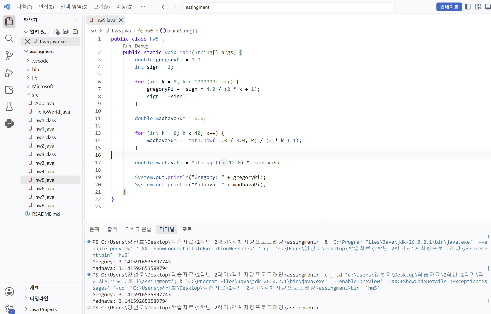
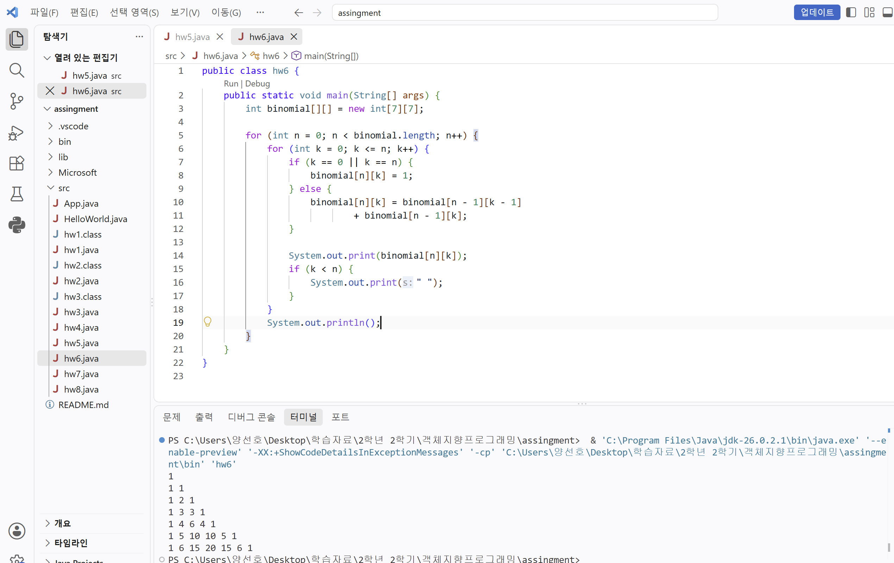
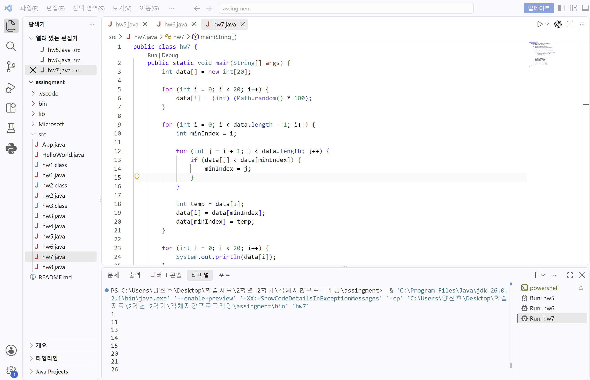
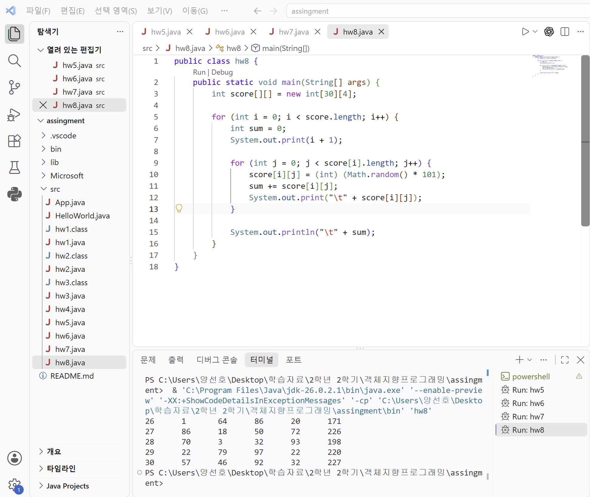

# OOP2026
### HomeWork1
```java
public class hw1 {
    public static void main(String[] args) {
        for (int i = 1; i <= 4; i++) {
            for (int j = 1; j <= i; j++) {
                System.out.print("#");
            }
            for (int j = 1; j <= 7 - i; j++) {
                System.out.print(" ");
            }

            for (int j = 1; j < i; j++) {
                System.out.print(" ");
            }
            for (int j = 1; j <= 5 - i; j++) {
                System.out.print("#");
            }
            for (int j = 1; j <= 3; j++) {
                System.out.print(" ");
            }

            for (int j = 1; j <= i; j++) {
                System.out.print("#");
            }
            for (int j = 1; j <= 7 - i; j++) {
                System.out.print(" ");
            }

            for (int j = 1; j < i; j++) {
                System.out.print(" ");
            }
            for (int j = 1; j <= 5 - i; j++) {
                System.out.print("#");
            }
            System.out.println();
        }
    }
}
```


### HomeWork2
```java
public class hw2 {
    public static void main(String[] args) {
        int first = 1;
        int second = 1;

        for (int i = 1; i <= 20; i++) {
            System.out.print(first);

            if (i < 20) {
                System.out.print(" ");
            }

            int next = first + second;
            first = second;
            second = next;
        }

        System.out.println();
    }
}
```


### HomeWork3
```java
public class hw3 {
    public static void main(String[] args) {
        int first = 1;
        int second = 1;

        for (int i = 1; i < 20; i++) {
            if (i >= 2) {
                double ratio = (double) second / first;
                System.out.println(second + "/" + first + "=" + ratio);
            }

            int next = first + second;
            first = second;
            second = next;
        }
    }
}
```


### HomeWork4
```java
public class hw4 {
    public static void main(String[] args) {
        for (int i = 1; i <= 9; i++) {
            for (int j = 1; j <= 9; j++) {
                System.out.print(j + "*" + i + "=" + (j * i));
                if (j < 9) {
                    System.out.print("\t");
                }
            }   
            System.out.println();
        }
    }
}
```


### HomeWork5
```java
public class hw5 {
    public static void main(String[] args) {
        double gregoryPi = 0.0;
        int sign = 1;

        for (int k = 0; k < 1000000; k++) {
            gregoryPi += sign * 4.0 / (2 * k + 1);
            sign = -sign;
        }

        double madhavaSum = 0.0;

        for (int k = 0; k < 40; k++) {
            madhavaSum += Math.pow(-1.0 / 3.0, k) / (2 * k + 1);
        }

        double madhavaPi = Math.sqrt(12.0) * madhavaSum;

        System.out.println("Gregory: " + gregoryPi);
        System.out.println("Madhava: " + madhavaPi);
    }
}
```


### HomeWork6
```java
public class hw6 {
    public static void main(String[] args) {
        int binomial[][] = new int[7][7];

        for (int n = 0; n < binomial.length; n++) {
            for (int k = 0; k <= n; k++) {
                if (k == 0 || k == n) {
                    binomial[n][k] = 1;
                } else {
                    binomial[n][k] = binomial[n - 1][k - 1]
                            + binomial[n - 1][k];
                }

                System.out.print(binomial[n][k]);
                if (k < n) {
                    System.out.print(" ");
                }
            }
            System.out.println();
        }
    }
}
```


### HomeWork7
```java
public class hw7 {
    public static void main(String[] args) {
        int data[] = new int[20];

        for (int i = 0; i < 20; i++) {
            data[i] = (int) (Math.random() * 100);
        }

        for (int i = 0; i < data.length - 1; i++) {
            int minIndex = i;

            for (int j = i + 1; j < data.length; j++) {
                if (data[j] < data[minIndex]) {
                    minIndex = j;
                }
            }

            int temp = data[i];
            data[i] = data[minIndex];
            data[minIndex] = temp;
        }

        for (int i = 0; i < 20; i++) {
            System.out.println(data[i]);
        }
    }
}
```


### HomeWork8
```java
public class hw8 {
    public static void main(String[] args) {
        int score[][] = new int[30][4];

        for (int i = 0; i < score.length; i++) {
            int sum = 0;
            System.out.print(i + 1);

            for (int j = 0; j < score[i].length; j++) {
                score[i][j] = (int) (Math.random() * 101);
                sum += score[i][j];
                System.out.print("\t" + score[i][j]);
            }

            System.out.println("\t" + sum);
        }
    }
}
```

