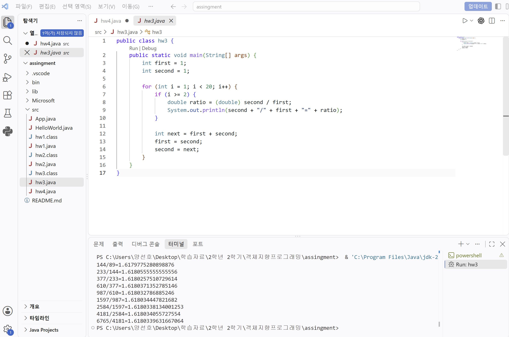
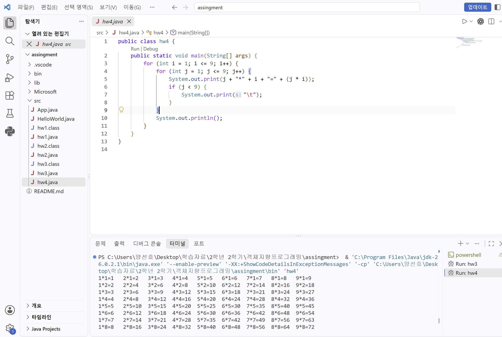

# OOP2026
### HomeWork1
```java
public class hw1 {
    public static void main(String[] args) {
        for (int i = 1; i <= 4; i++) {
            for (int j = 1; j <= i; j++) {
                System.out.print("#");
            }
            for (int j = 1; j <= 7 - i; j++) {
                System.out.print(" ");
            }

            for (int j = 1; j < i; j++) {
                System.out.print(" ");
            }
            for (int j = 1; j <= 5 - i; j++) {
                System.out.print("#");
            }
            for (int j = 1; j <= 3; j++) {
                System.out.print(" ");
            }

            for (int j = 1; j <= i; j++) {
                System.out.print("#");
            }
            for (int j = 1; j <= 7 - i; j++) {
                System.out.print(" ");
            }

            for (int j = 1; j < i; j++) {
                System.out.print(" ");
            }
            for (int j = 1; j <= 5 - i; j++) {
                System.out.print("#");
            }
            System.out.println();
        }
    }
}
```


### HomeWork2
```java
public class hw2 {
    public static void main(String[] args) {
        int first = 1;
        int second = 1;

        for (int i = 1; i <= 20; i++) {
            System.out.print(first);

            if (i < 20) {
                System.out.print(" ");
            }

            int next = first + second;
            first = second;
            second = next;
        }

        System.out.println();
    }
}
```


### HomeWork3
```java
public class hw3 {
    public static void main(String[] args) {
        int first = 1;
        int second = 1;

        for (int i = 1; i < 20; i++) {
            if (i >= 2) {
                double ratio = (double) second / first;
                System.out.println(second + "/" + first + "=" + ratio);
            }

            int next = first + second;
            first = second;
            second = next;
        }
    }
}
```


### HomeWork4
```java
public class hw4 {
    public static void main(String[] args) {
        for (int i = 1; i <= 9; i++) {
            for (int j = 1; j <= 9; j++) {
                System.out.print(j + "*" + i + "=" + (j * i));
                if (j < 9) {
                    System.out.print("\t");
                }
            }   
            System.out.println();
        }
    }
}
```

